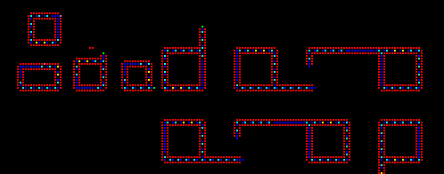

# Evoloops
Evoloops, originially proposed by Hiroki Sayama in 1999, is an extension of SDSR Loops capable of evolution. Essentially, smaller loops are favoured by 'natural selection', and thus over time, loops will become smaller and smaller. Just like SDSR loops, evoloops dissolve after dying, thus allowing for continual replication in finite space. Evoloops is arguably the most well know extension of Langton's Loops, dibeing proposed 15 years after Langton's original proposition.

>Smaller loops are favoured as time goes on

## Initial State

Evoloops begins in a similar initial state to Langton's Loops, but with a larger loop and no extension arm.
Due to its larger size, Evoloops requires much more space to operate than Langton's Loops or SDSR Loops. Settings used in the processing file do slow down computation, but allow for more interesting behaviours to be observed.

 

# Dead Bodies
As generations pass and more loops die, occasionally parts of a loop's sheath will remain after its death. These so-called dead bodies may interfere with the reproduction of other loops.

---

## Sources

[Original Proposition (1999)](https://www.researchgate.net/profile/Hiroki_Sayama/publication/2577056_Toward_the_Realization_of_an_Evolving_Ecosystem_on_Cellular_Automata/links/0fcfd50cb96f7aa3f4000000.pdf) *Journal Article proposing Evoloops. Contains some pretty hefty analysis and discussion*
