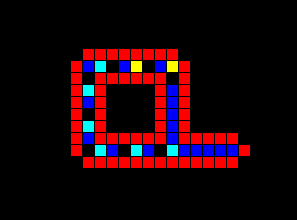
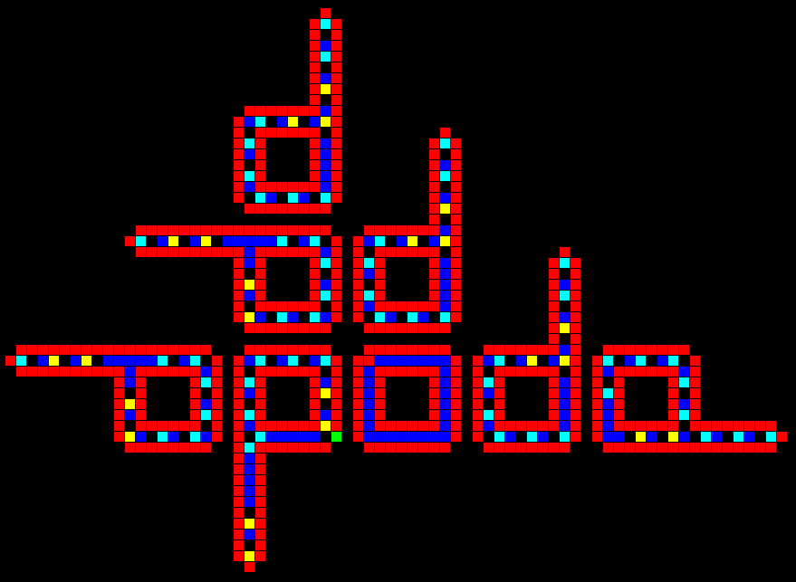

# Langton's Loops
Langton's loops is a self-relicating [cellular automaton](https://en.wikipedia.org/wiki/Cellular_automaton) created by [Christopher Langton](https://en.wikipedia.org/wiki/Christopher_Langton) in 1984. Cells contain genetic material which flows through each loop, eventually breaking off to form a new loop, hence the term 'self-replicating'. Although Langton was not the first to propose a self-replicating automaton, his was was much simpler than those proposed before his (most notably von Neumann's [Universal Constructor](https://en.wikipedia.org/wiki/Von_Neumann_universal_constructor), which consisted of 29 states (whereas Langton's consists of only 8 states)).

## Initial State
Langton's loops begins in its initial state, pictured below, in which a single loop and partial extension arm exist. From the initial state, an arm will begin to extend out to the right and will eventually form a second, completely independent loop. 

 

>Initial state
---

As each loop progress, it will 'reproduce' more loops around it in a counterclockwise fashion. Loops cannot reproduce in areas where another loop already exists. Therefore, without infinite space, the population of loops is bounded. If a loop can no longer reproduce, it will succomb to a 'death' state in which it's genetic material will remain unchanged.

 

>Dead loop (located in center)
---

More information about Langton's Loops as well as implementation details can be found within the info tab of the NetLogo file. The processing file contains a visual implementation of LL that runs much quicker than the NetLogo version, as the NL version is rather slow.

## Sources
[Original Netlogo Code](ccl.northwestern.edu/netlogo/community/Loop%20de%20Langton%202.nlogo). *Note that this implmentation is incorrect. Specifically, the initial state of the model has one incorrect cell, which was fixed for the implmentation in this repository.*

[Langton's Article (1984)](http://deepblue.lib.umich.edu/bitstream/handle/2027.42/24968/0000395.pdf?sequence=1) *Original proposition of Langton's Loops and discussion of self-replicating automata*

[Langton's Loops Wikipedia](https://en.wikipedia.org/wiki/Langton%27s_loops) *Not particularily useful but contains pictures of LL and information about additional self-replicating automata*
