# SDSR Loops
SDSR (**S**elf-**D**issolving, **S**elf-**R**eplicating) Loops is an extension of Langton's Loops, created by Hiroki Sayama in 1998, in which loops will dissolve after dying. When a loop dies, it dissolves, allowing for other loops to reproduce in its place. Due to the dissolution of dead loops, SDSR Loops can continually reproduce in a finite environment.

SDSR Loops utilises 9 states, as compared to Langton's 8, with the 9th state used to dissolve loops.

## Initial State
SDSR Loops begins in the same initial state as Langton's loops

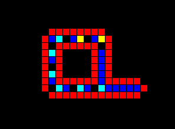 

## Death

Immediately following a collision, a loop will begin its death. First, the extension arm will retract, then the loop will begin to recede in on itself until it fully dissolves. 

### Collision

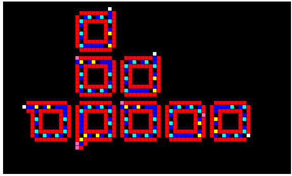 

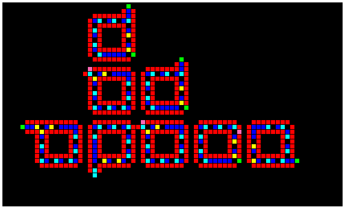 

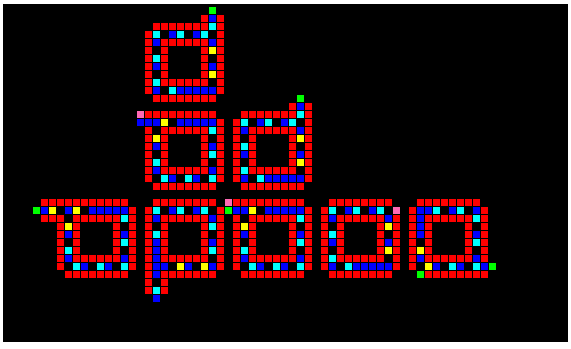 

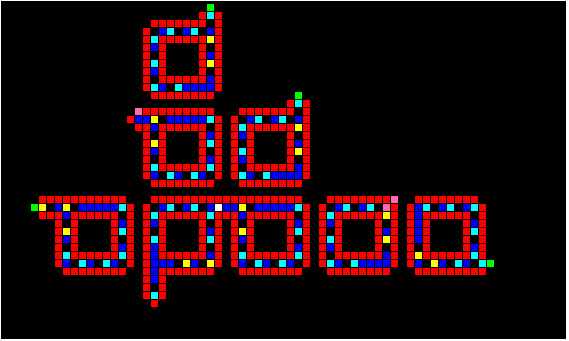 

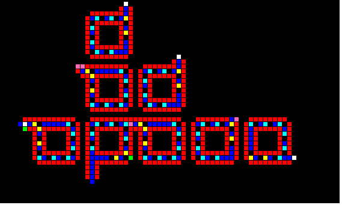 

 

### Receding

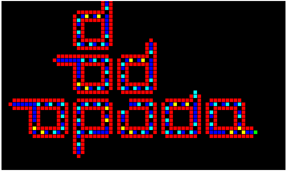 

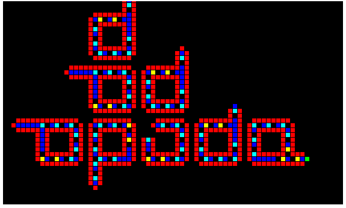 

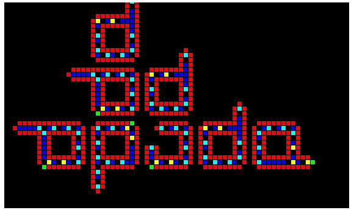 

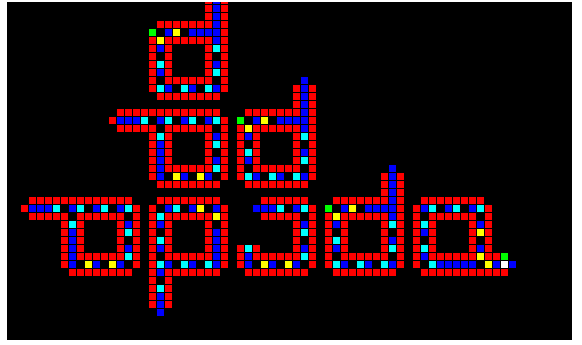 

### Dissolution

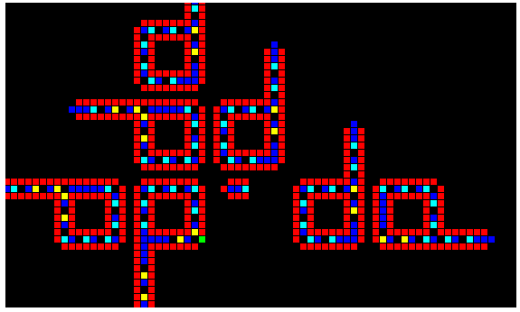 

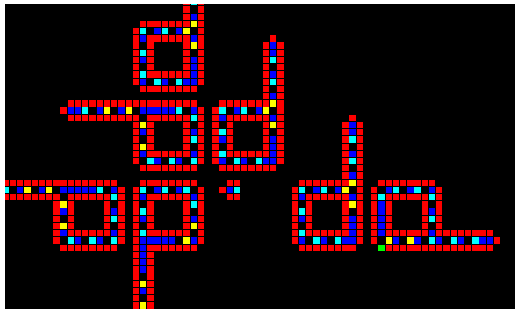 

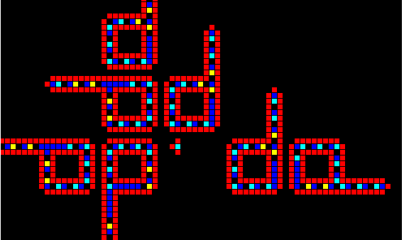 

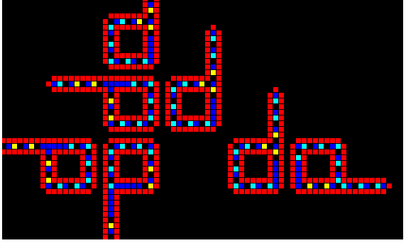

## Sources

Unfortunately, there isn't much information available online for SDSR loops apart from a brief mention in the Wikipedia page for Langton's Loops. The original journal article appears to be lost in time, but the abstract can be found [here](http://interjournal.org/manuscript_abstract.php?2404).
